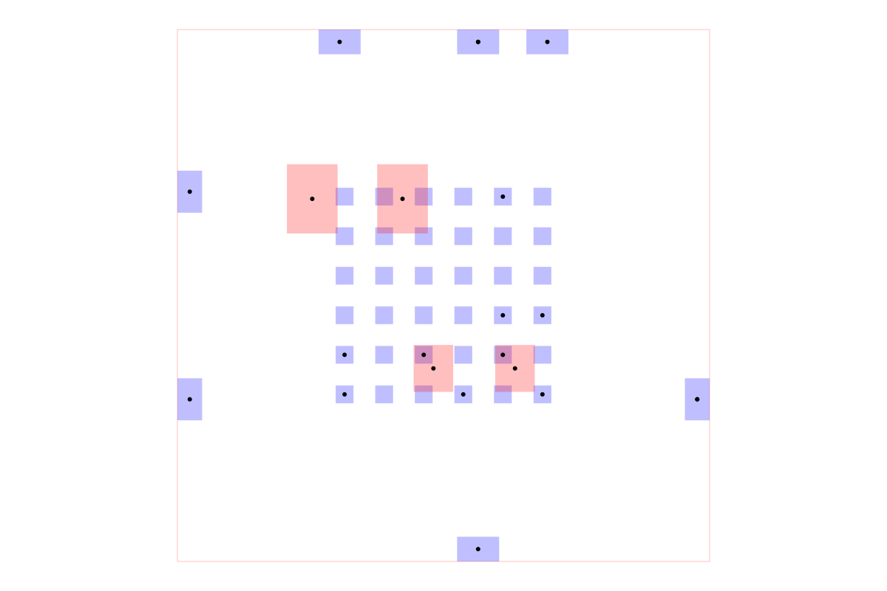

# dataset-srj19-bga-passive-overlays

A dataset of 200 BGA breakout routing problems for validating an autorouter can route BGA fanouts while randomized passive component keepouts occupy the opposite PCB layer around the BGA footprint.

Each sample contains a centered BGA pad grid. Every connection has exactly one BGA endpoint, and every fanout pad is placed on an edge of the board. Passive component keepouts are generated as a deterministic random subset around the BGA footprint on the opposite layer, with varied sizes, orientations, and offsets:

- Even-numbered samples: BGA and fanout pads on `top`, passive components on `bottom`.
- Odd-numbered samples: BGA and fanout pads on `bottom`, passive components on `top`.

## Example

The image below shows `sample001`. It is generated by constructing an
`AutoroutingPipelineSolver`, calling `.visualize()`, and converting the
graphics object to SVG with `graphics-debug`.

Regenerate it with `npm run generate:readme-image`. Run `npm run start` to
browse all 200 samples in Cosmos. `npm run build:site` exports the static
catalog to `cosmos-export/` for Vercel.

Run `npm run generate` after changing the source samples, then run `npm run build:dataset-dist` to refresh `dataset-dist/manifest.json`.
